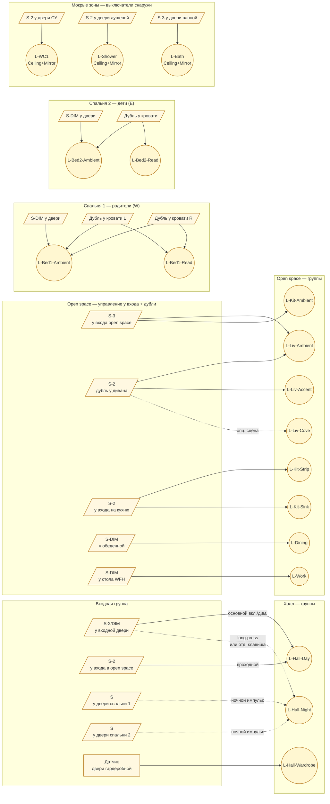
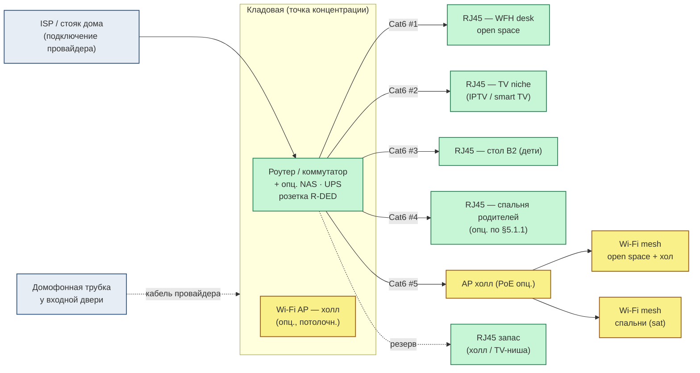
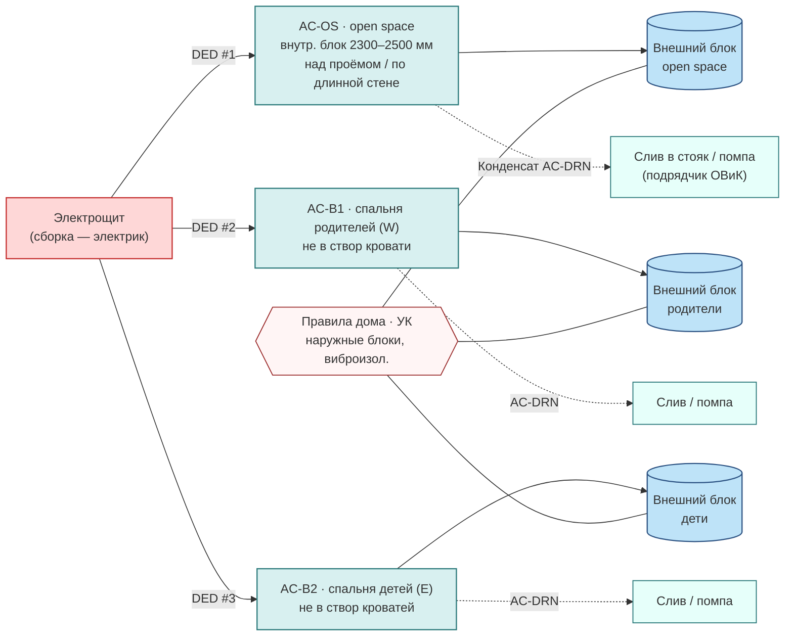
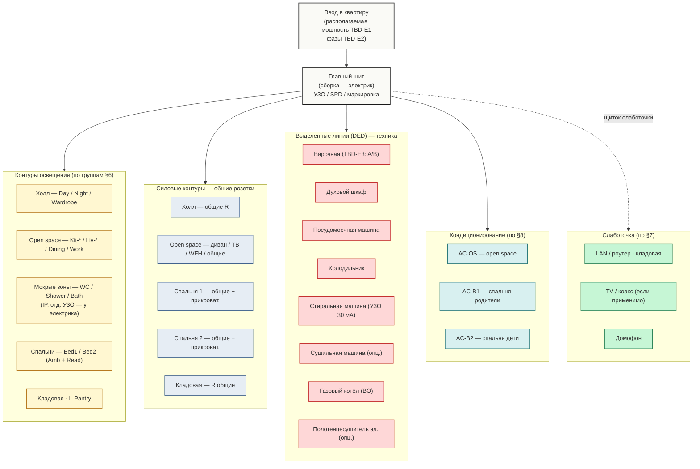

# Квартира 93, ул. Жусупа Мамая 16, Бишкек — электрическая схема (designer-level)

**Связанные документы:**

- Требования заказчика — [`apartment-project-requirements.md`](./apartment-project-requirements.md) (бриф, помещения, свет, сплиты, варочная, LAN).
- Артефакты дизайнера и пакет передачи — [`interior-designer-deliverables.md`](./interior-designer-deliverables.md).
- Указатель документации — [`apartment-design-requirements.md`](./apartment-design-requirements.md).

**Тип документа:** **дизайн-схема электрики и слаботочки** уровня **DD/CD** в интерьерных границах: **позиции** розеток / выключателей / точек данных / ТВ / кондиционеров / встроенной техники, **высоты установки**, **логика выключателей**, **группы освещения** и **спека встроенной техники с пометкой «выделенная линия»**. Документ предназначен **для лицензированного электрика и проектировщика ОВиК**: он использует эту схему для **расчёта сечений, автоматов, УЗО/диффавтоматов, заземления, щита и согласования с нормами в юрисдикции объекта**.

**Версия документа:** 1.1 · **Дата:** 2026-04-19 · **Кратко:** добавлены визуальные схемы — **§3.1** elevation (mounting heights), **§4.1** floor-plan electrical overlay (SVG, geometry per design-book), **§5.6.A** IP-zones reference (SVG), **§6.1** switching-logic flow (mermaid), **§7.1** LAN star (mermaid), **§8.1** AC topology (mermaid), **§10.1** panel logical grouping (mermaid). Точки и сценарии освещения — после обмера и закрытия **TBD-5** (мокрая стена кухни, см. требования **§6**).

**Единицы:** SI — **мм** для высот, **м** для трасс, **Вт / кВт** только как **информативная нагрузка по паспорту техники** (не сечение и не автомат).

---

## Оглавление

1. [Назначение, границы дизайна и красные линии](#section-1)
2. [Условные обозначения и легенда](#section-2)
3. [Высоты установки (типовые ориентиры до обмера)](#section-3) — [§3.1 elevation SVG](#section-3-1)
4. [Сводная матрица точек по помещениям](#section-4) — [§4.1 plan overlay SVG](#section-4-1)
5. [По помещениям — детальные ведомости](#section-5) — [§5.6.A IP-zones reference SVG](#section-5-wet-zones)
   - [5.1 Холл / коридор](#section-5-1)
   - [5.2 Open space — кухонный блок](#section-5-2)
   - [5.3 Open space — обеденная зона](#section-5-3)
   - [5.4 Open space — гостиная и ТВ](#section-5-4)
   - [5.5 Open space — рабочее место](#section-5-5)
   - [5.6 Кладовая](#section-5-6)
   - [5.7 Гостевой санузел (1,6 м²)](#section-5-7)
   - [5.8 Душевая (3,1 м²)](#section-5-8)
   - [5.9 Ванная (4,2 м²)](#section-5-9)
   - [5.10 Спальня ~15,1 м²](#section-5-10)
   - [5.11 Спальня ~14,2 м²](#section-5-11)
   - [5.12 Лоджии и балкон](#section-5-12)
6. [Группы освещения и логика выключателей](#section-6) — [§6.1 switching-logic mermaid](#section-6-1)
7. [Слаботочка: LAN / TV / домофон / умный дом](#section-7) — [§7.1 LAN topology mermaid](#section-7-1)
8. [Кондиционирование — питание и дренаж (привязка к ОВиК)](#section-8) — [§8.1 AC topology mermaid](#section-8-1)
9. [Газовый котёл и автономное отопление — координация](#section-9)
10. [Что должен рассчитать лицензированный электрик](#section-10) — [§10.1 panel grouping mermaid](#section-10-1)
11. [Открытые вопросы и риски (TBD-E)](#section-11)
12. [Приёмка и проверка на объекте](#section-12)
13. [Дисклеймер](#section-13)

---

## 1. Назначение, границы дизайна и красные линии

**Что фиксирует этот документ (зона дизайнера интерьера):**

- **позиции** в плане и развертках: розетки силовые, выключатели, точки слаботочки (RJ45, ТВ, домофон), точки питания встроенной техники, точки питания светильников и сплит-систем;
- **высоты установки** от чистого пола / относительно столешниц и зеркал;
- **логика управления освещением** — какие группы переключаются с каких мест, диммирование, проходные / маршевые сценарии, ночной контур;
- **логика расположения выводов** под мебель (за фасадом, в нише, в боковине корпуса) — для увязки с ведомостью отделки, корпусной мебелью и кухней;
- **информативная нагрузка** встроенной техники по паспорту (кВт) — как **исходные данные** электрику, **не как** сечение/автомат.

**Что не входит (вне дизайнерского пакета — лицензированный электрик / проектировщик):**

- расчёт **сечений** кабеля и **автоматов**, выбор **УЗО / дифавтоматов** и токов утечки, **заземление**, **уравнивание потенциалов** в мокрых зонах;
- проектирование и **сборка щита**, фазировка, маркировка автоматов, защита от перенапряжения **(SPD)**;
- проверка **располагаемой мощности** на квартиру и согласование с УК / поставщиком электроэнергии;
- замена / расширение **главного электрощита**, ввод **трёхфазного питания** — см. требования **§3.4**, **§4.2**;
- сертификация и приёмка скрытых работ электрики;
- проектирование **газа** и **дымоудаления** (см. **§9** ниже — только координация).

**Красные линии (по требованиям §4.2):** главный электрощит, ввод фасадных трасс, газовый узел и котёл, мокрые стояки — **не трогаем без согласованной документации**. Любое расширение мощности, перенос ввода или штробление в несущих — **отдельный пакет** с архитектором / инженером.

---

## 2. Условные обозначения и легенда

*Минимальный набор для согласования с электриком; финальные обозначения — по ГОСТ / стандарту чертежей электрика на объекте.*

| Символ (вариант для CAD/PDF) | Значение |
|------------------------------|----------|
| `R` | Розетка силовая 230 В, одинарная |
| `R×2`, `R×3` | Розетка двойная / тройная (блок) |
| `R-WP` | Розетка влагозащищённая (брызгозона / лоджия) — **IP44+** |
| `R-DED` | **Выделенная линия** к розетке (для крупной техники / котла / сплита) |
| `USB` | Розетка USB-A / USB-C (комбинированная или отдельная) |
| `S` | Выключатель одноклавишный |
| `S-2`, `S-3` | Двух- / трёхклавишный |
| `S-DIM` | Диммер (с пометкой совместимости — см. **§6**) |
| `S-WAY` | Проходной (двухполюсный для двух точек управления) |
| `S-MOT` | Датчик движения / присутствия |
| `LAN` | RJ45, Cat6 (или Cat6a) |
| `TV` | Антенный / коаксиальный или IP-ТВ через LAN — см. **§5.0** требований |
| `DOMO` | Точка домофона / трубка |
| `AC-PWR` | Питание внутреннего блока сплит-системы |
| `AC-DRN` | Дренажная трасса конденсата сплита |
| `BO` | Котёл газовый — питание (отдельная линия с УЗО) |
| `L1 … Ln` | Группа освещения (логическая, см. **§6**) |

**Условие на чертеже:** каждая позиция в плане сопровождается **высотой установки** (мм AFF — above finished floor) или ссылкой на типовую высоту из **§3** ниже; для розеток у столешниц / встроенной техники — **высота от верха чистовой столешницы** (мм AFF С).

---

## 3. Высоты установки (типовые ориентиры до обмера)

*Высоты предлагаются как стартовый стандарт под скандинавский / джапанди характер интерьера и эргономику взрослого + дети. Любая отметка может быть скорректирована по обмеру и развертке мебели — фиксировать в развертках и сверять на мокапе.*

| Тип точки | Высота, мм AFF | Примечание |
|-----------|---------------|------------|
| Розетка общего назначения (жилые комнаты, низ стены) | **300** | Современный стандарт; согласовать с плинтусом и встроенной мебелью |
| Розетка для прикроватного света / зарядок (спальни) | **700–800** | Над уровнем матраса; высота уточняется по габариту кровати/тумбы |
| Розетка над письменным / рабочим столом | **1100** | Над столешницей; уточнить под кабель-канал и монитор |
| Розетка над кухонной столешницей | **1050–1100** | ~150 мм над верхом столешницы (типовая столешница ~900 мм) |
| Розетка вытяжки (за вытяжкой / в верхнем шкафу) | **2100–2200** | Скрытая, доступ через шкаф |
| Розетка холодильника | **по нише** | За холодильником / в соседнем шкафу — **доступ для отключения** |
| Розетка посудомоечной машины (в соседнем шкафу) | **300–600** | За плинтусом доступ запрещён — **в соседнем корпусе** |
| Розетка стиральной / сушильной машины | **1000–1100** | Над машиной / в соседнем корпусе, **IP44+** в зоне брызг |
| Выключатель (общая высота) | **900** | Современный стандарт; альтернатива «1500 мм» (старая школа) — **не рекомендуется** для этого интерьера |
| Выключатель у двери — **со стороны ручки** | **900** | Расстояние от косяка ~100–150 мм |
| ТВ (розетка + LAN + кабель-канал) | **1200–1500** | Центр экрана ~ уровень глаз сидя; точно — после выбора диагонали |
| Светильник у зеркала (ванная), боковой бра | **1700–1800** | По центру лица стоящего человека; уточнять по высоте зеркала |
| Питание внутреннего блока сплит-системы | **2300–2500** | За корпусом блока; **до** монтажа блока согласовать с поставщиком |
| Домофонная трубка / монитор | **1500** | У входной двери, со стороны ручки |
| Розетки на лоджии / балконе | **300+ IP44** | Только если лоджия в **тёплом контуре** и согласование УК; иначе — **н/п** |

**Принципы:**

1. **Выключатели — со стороны ручки двери**, не «за дверью».
2. В **спальнях** — у двери и **дубль у кровати** (с обеих сторон, если двуспальная) — для основного контура и/или ночника.
3. В **холле** — проходные сценарии «вход / гостиная / спальни» — см. **§6**.
4. В **мокрых зонах** — выключатели **снаружи** двери, кроме разрешённых внутри (короткий импульс на полотенцесушитель / тёплый пол) — **уточнить с электриком по зонам IP**.
5. Розетки **группами 2–3** в зонах активного использования (рабочее место, кухня, ТВ-стена) — лучше один блок, чем «удлинители на видном месте».

### 3.1 Эталон высот — настенный разрез (SVG)

*Схематический разрез одной стены жилой комнаты с типовыми высотами (мм AFF) — для сверки с электриком на этапе разводки до штробления. Не масштабная развертка, а навигационная высотная шкала.*

<svg xmlns="http://www.w3.org/2000/svg" viewBox="0 0 880 540" role="img" aria-label="Wall elevation reference: typical mounting heights AFF for sockets, switches, TV, AC, mirror, kitchen counter outlets">
  <defs>
    
  </defs>

  <text class="ttl" x="20" y="22">Reference wall elevation · 1 unit = 5 mm · 2700 mm ceiling</text>

  <!-- Wall surface -->
  <rect class="wall-bg" x="120" y="40" width="640" height="440"/>
  <!-- Ceiling band -->
  <rect class="ceil" x="120" y="35" width="640" height="10"/>
  <!-- Floor band -->
  <rect class="floor" x="120" y="475" width="640" height="20"/>
  <text class="lbl" x="125" y="510">Finished floor (AFF datum 0 mm)</text>
  <text class="lbl" x="125" y="33">Ceiling 2700 mm</text>

  <!-- Vertical AFF axis on left -->
  <line class="axis" x1="100" y1="475" x2="100" y2="40"/>
  <!-- Ticks at 0, 300, 700, 900, 1100, 1500, 1700, 2100, 2500, 2700 -->
  <!-- mapping: y = 475 - (mm * 0.16)  (440 px = 2750 mm)  -->
  <g>
    <line class="tick" x1="95" y1="475" x2="120" y2="475"/>
    <text class="lbl-num" x="92" y="479">0</text>
    <line class="gridline" x1="120" y1="427" x2="760" y2="427"/>
    <line class="tick"     x1="95"  y1="427" x2="120" y2="427"/>
    <text class="lbl-num"  x="92"  y="431">300</text>
    <line class="gridline" x1="120" y1="363" x2="760" y2="363"/>
    <line class="tick"     x1="95"  y1="363" x2="120" y2="363"/>
    <text class="lbl-num"  x="92"  y="367">700</text>
    <line class="gridline" x1="120" y1="331" x2="760" y2="331"/>
    <line class="tick"     x1="95"  y1="331" x2="120" y2="331"/>
    <text class="lbl-num"  x="92"  y="335">900</text>
    <line class="gridline" x1="120" y1="299" x2="760" y2="299"/>
    <line class="tick"     x1="95"  y1="299" x2="120" y2="299"/>
    <text class="lbl-num"  x="92"  y="303">1100</text>
    <line class="gridline" x1="120" y1="235" x2="760" y2="235"/>
    <line class="tick"     x1="95"  y1="235" x2="120" y2="235"/>
    <text class="lbl-num"  x="92"  y="239">1500</text>
    <line class="gridline" x1="120" y1="203" x2="760" y2="203"/>
    <line class="tick"     x1="95"  y1="203" x2="120" y2="203"/>
    <text class="lbl-num"  x="92"  y="207">1700</text>
    <line class="gridline" x1="120" y1="139" x2="760" y2="139"/>
    <line class="tick"     x1="95"  y1="139" x2="120" y2="139"/>
    <text class="lbl-num"  x="92"  y="143">2100</text>
    <line class="gridline" x1="120" y1="75"  x2="760" y2="75"/>
    <line class="tick"     x1="95"  y1="75"  x2="120" y2="75"/>
    <text class="lbl-num"  x="92"  y="79">2500</text>
  </g>
  <text class="lbl" x="20" y="56" transform="rotate(-90 20 56)">Height AFF, mm</text>

  <!-- Symbols placed at correct heights -->
  <!-- General outlet 300 mm (living/bedroom) -->
  <g transform="translate(180,427)">
    <circle class="sym-r" r="8"/>
    <line class="leader" x1="9" y1="0" x2="60" y2="-25"/>
    <text class="lbl" x="62" y="-22">R · 300 — outlet общ.</text>
  </g>

  <!-- Bedside outlet 750 mm -->
  <g transform="translate(180,355)">
    <circle class="sym-r" r="8"/>
    <line class="leader" x1="9" y1="0" x2="60" y2="-12"/>
    <text class="lbl" x="62" y="-9">R · 700–800 — прикроват.</text>
  </g>

  <!-- Switch 900 mm -->
  <g transform="translate(310,331)">
    <rect class="sym-s" x="-9" y="-9" width="18" height="18"/>
    <line class="leader" x1="10" y1="0" x2="55" y2="0"/>
    <text class="lbl" x="58" y="3">S · 900 — выключатель (рекомендация)</text>
  </g>

  <!-- Counter outlet 1100 mm -->
  <g transform="translate(580,299)">
    <circle class="sym-r" r="8"/>
    <line class="leader" x1="-9" y1="0" x2="-50" y2="0"/>
    <text class="lbl" x="-235" y="3">R · 1050–1100 — кухня над столешницей</text>
  </g>

  <!-- Mirror sconce 1750 mm -->
  <g transform="translate(580,219)">
    <rect class="sym-mir" x="-12" y="-6" width="24" height="12"/>
    <line class="leader" x1="-13" y1="0" x2="-50" y2="0"/>
    <text class="lbl" x="-260" y="3">Бра / лицо у зеркала · 1700–1800</text>
  </g>

  <!-- TV centre 1300 mm -->
  <g transform="translate(420,267)">
    <rect class="sym-tv" x="-22" y="-13" width="44" height="26" rx="3"/>
    <line x1="-10" y1="13" x2="10" y2="13" stroke="#1a1a1a" stroke-width="1.5"/>
    <line class="leader" x1="22" y1="0" x2="60" y2="0"/>
    <text class="lbl" x="62" y="3">ТВ — центр экрана 1200–1500</text>
  </g>

  <!-- AC indoor unit 2400 mm -->
  <g transform="translate(310,107)">
    <rect class="sym-ac" x="-30" y="-10" width="60" height="20" rx="3"/>
    <text class="lbl" x="-26" y="4">AC</text>
    <line class="leader" x1="31" y1="0" x2="65" y2="10"/>
    <text class="lbl" x="68" y="13">Внутр. блок сплита · 2300–2500</text>
  </g>

  <!-- Boiler power outlet behind cabinet ~1800 mm (illustrative) -->
  <g transform="translate(680,219)">
    <rect class="sym-bo" x="-10" y="-10" width="20" height="20"/>
    <text class="lbl" x="-7" y="4">BO</text>
    <line class="leader" x1="-12" y1="0" x2="-50" y2="20"/>
    <text class="lbl" x="-200" y="23">Котёл — питание (DED + УЗО)</text>
  </g>

  <!-- Door ref (right side) -->
  <rect x="700" y="155" width="50" height="320" fill="none" stroke="#9c4221" stroke-width="1.5"/>
  <text class="lbl" x="704" y="170" fill="#9c4221">Door 800×2050</text>
</svg>

**Чтение схемы:** левая шкала — высота от чистого пола; пунктирные сетки = типовые отметки; символы — маркеры для согласования с электриком. Любая отметка адаптируется по обмеру и развертке мебели. Дверь справа — для напоминания «выключатель **со стороны ручки**».

---

## 4. Сводная матрица точек по помещениям

*Цифры — **минимальный** дизайнерский ориентир для расчёта группы и щита электриком; финальное число — по чертежам после обмера и согласования мебели.*

| Помещение | Розетки 230 В, общие | Розетки выделенные (DED) | Выключатели / диммеры | LAN (Cat6) | TV / коакс | Сплит (PWR/DRN) | Свет — отд. групп |
|-----------|----------------------|---------------------------|------------------------|------------|------------|------------------|--------------------|
| Холл / коридор | **2–3** | — | **3–5** | 0 | 0 | — | **2** (день + ночь) |
| Open space — кухня | **6–8** (рабочая зона) | **5–7** *(см. §5.2)* | **2–3** | 0–1 | 0 | — | **3** (фартук + раковина + варочная) |
| Open space — обед | **1–2** | — | **1** (диммер) | 0 | 0 | — | **1** (стол) |
| Open space — гостиная / ТВ | **3–4** | — | **2–3** | **1** (ТВ) | **1** *(если нужен)* | **1** | **2** (фон + акцент) |
| Open space — рабочее место | **2** (блок) | — | **1** | **1** (мин.) | 0 | — | **1** (диммер) |
| Кладовая | **1** | **0–1** *(NAS/UPS)* | **1** (вход + дубль) | **0–1** | 0 | — | **1** |
| СУ 1,6 м² | **0** *(внутри — по электрику)* | — | **1** (снаружи) | 0 | 0 | — | **2** (потолок + лицо) |
| Душевая 3,1 м² | **0–1** (IP44+ снаружи зоны) | **1** *(сушка полотенец)* | **1–2** | 0 | 0 | — | **2** (потолок IP65 + лицо) |
| Ванная 4,2 м² | **1–2** (IP44+) | **1–2** *(стиралка / сушилка)* | **1–2** | 0 | 0 | — | **2** (потолок + лицо) |
| Спальня ~15,1 м² | **4** (включая прикроват) | — | **2** (основной + дубль у кровати) | **0–1** *(по §5.0)* | **0–1** | **1** | **2** (фон + чтение) |
| Спальня ~14,2 м² | **4** | — | **2** | **0–1** | **0–1** | **1** | **2** |
| Лоджия (3,7 м²) | **0–1** *(IP44, если тепло)* | — | **1** *(если свет)* | 0 | 0 | — | **1** *(если применимо)* |
| Лоджия (4,4 м²) | **0–1** *(IP44, если тепло)* | — | **1** | 0 | 0 | — | **1** *(если применимо)* |
| Балкон (3,2 м²) | **0** *(холодный контур по умолчанию)* | — | **0–1** | 0 | 0 | — | **0–1** |
| **Котёл газовый** | — | **1** (BO) | — | — | — | — | — |

**Итого ориентир:** ~**40–50** розеток, ~**6–10** LAN-точек, **3** сплита, **1** котёл, ~**10–14** групп освещения. **Только для оценки запаса по щиту** — не как договорный объём.

### 4.1 План квартиры — оверлей электрозон (SVG)

*Геометрия и расположение помещений согласованы с поэтажным планом design-book (envelope ≈ 7200 × 15400 мм; родители на западе с лоджией 4,4 м², дети на востоке с балконом 3,2 м², open space на севере, мокрый блок и кладовая в среднем крыле, ванная между спальнями на юге). Здесь — **навигационный** оверлей электрозон: каждая зона помечена группами освещения, AC, BO и опорными точками; **точные координаты розеток / выключателей** — на исполнительных чертежах электрика после обмера.*

<svg xmlns="http://www.w3.org/2000/svg" viewBox="-2200 -2300 11400 19400" role="img" aria-label="Electrical zone overlay on apartment 93 floor plan: lighting groups, AC indoor units, boiler position, LAN backbone star from pantry">
  <defs>
    
  </defs>

  <!-- Title -->
  <text class="ttl-e" x="0" y="-1800">Apartment 93 — electrical zone overlay (1 SVG unit = 1 mm)</text>

  <!-- Outer envelope (single rect for clarity, walls 200) -->
  <path class="wall-e" fill-rule="evenodd"
        d="M0,0 H7200 V15400 H0 Z M200,200 H7000 V15200 H200 Z"/>

  <!-- Re-cut openings (window/door slits) -->
  <rect class="room-e" x="4100" y="0" width="2900" height="200"/>
  <rect class="room-e" x="7000" y="7600" width="200" height="900"/>
  <rect class="room-e" x="7000" y="10300" width="200" height="2700"/>
  <rect class="room-e" x="0" y="10100" width="200" height="3400"/>

  <!-- Room fills -->
  <rect class="room-e" x="200" y="200" width="6800" height="5200"/>      <!-- open space -->
  <rect class="room-e" x="200" y="5600" width="6800" height="3700"/>     <!-- hall -->
  <rect class="wet-e"  x="200" y="5600" width="1300" height="1300"/>     <!-- WC 1.6 -->
  <rect class="wet-e"  x="200" y="7100" width="1700" height="1850"/>     <!-- Shower 3.1 -->
  <rect class="stor-e" x="5300" y="5600" width="1700" height="1800"/>    <!-- Pantry 2.8 -->
  <rect class="room-e" x="200" y="9500" width="6800" height="5700"/>     <!-- bedrooms wing -->
  <rect class="wet-e"  x="2700" y="10500" width="1600" height="2600"/>   <!-- Bath 4.2 -->
  <rect class="stor-e" x="2900" y="9500" width="1400" height="1000"/>    <!-- Vestibule -->

  <!-- Internal partitions (simplified) -->
  <rect class="wall-e" x="200"  y="5400" width="2600" height="200"/>
  <rect class="wall-e" x="4600" y="5400" width="2400" height="200"/>
  <rect class="wall-e" x="200"  y="9300" width="400"  height="200"/>
  <rect class="wall-e" x="1400" y="9300" width="1300" height="200"/>
  <rect class="wall-e" x="3700" y="9300" width="1500" height="200"/>
  <rect class="wall-e" x="6000" y="9300" width="1000" height="200"/>
  <rect class="wall-e" x="1500" y="5600" width="200"  height="500"/>
  <rect class="wall-e" x="1500" y="6800" width="200"  height="100"/>
  <rect class="wall-e" x="200"  y="6900" width="1500" height="200"/>
  <rect class="wall-e" x="1900" y="7100" width="200"  height="900"/>
  <rect class="wall-e" x="1900" y="8800" width="200"  height="150"/>
  <rect class="wall-e" x="200"  y="8950" width="1900" height="200"/>
  <rect class="wall-e" x="5300" y="5600" width="200"  height="600"/>
  <rect class="wall-e" x="5300" y="7000" width="200"  height="400"/>
  <rect class="wall-e" x="5300" y="7400" width="1700" height="200"/>
  <rect class="wall-e" x="2700" y="10500" width="1600" height="200"/>
  <rect class="wall-e" x="2700" y="13100" width="1600" height="200"/>
  <rect class="wall-e" x="2700" y="10500" width="200"  height="2600"/>
  <rect class="wall-e" x="4300" y="10500" width="200"  height="2600"/>
  <rect class="wall-e" x="2700" y="9500"  width="200"  height="1000"/>
  <rect class="wall-e" x="4300" y="9500"  width="200"  height="1000"/>
  <rect class="wall-e" x="2700" y="13100" width="200"  height="2100"/>
  <rect class="wall-e" x="4300" y="13100" width="200"  height="2100"/>

  <!-- External: loggias / balcony -->
  <rect class="ext-e" x="4100" y="-1300" width="2900" height="1300"/>
  <text class="lbl-ar-e" x="5550" y="-700">Loggia 3.7 m² (kitchen)</text>
  <rect class="ext-e" x="-1300" y="10100" width="1300" height="3400"/>
  <text class="lbl-ar-e" x="-650" y="11800">Loggia 4.4</text>
  <text class="lbl-ar-e" x="-650" y="12010">(parents W)</text>
  <rect class="ext-e" x="7200" y="10300" width="1200" height="2700"/>
  <text class="lbl-ar-e" x="7800" y="11700">Balcony 3.2</text>
  <text class="lbl-ar-e" x="7800" y="11910">(children E)</text>

  <!-- Compass -->
  <g transform="translate(8200,-1000)">
    <circle r="280" fill="none" stroke="#2c5282" stroke-width="40"/>
    <path d="M0,-260 L120,180 L0,80 L-120,180 Z" fill="#2c5282"/>
    <text class="compass" y="-360">N</text>
  </g>

  <!-- Room labels -->
  <text class="lbl-rm-e" x="3600" y="2600">Open space (kitchen + dining + living + WFH)</text>
  <text class="lbl-ar-e" x="3600" y="2840">35.6 m²</text>
  <text class="lbl-rm-e" x="3700" y="7400">Hall · 17.0 m²</text>
  <text class="lbl-ar-e" x="850"  y="6300">WC 1.6</text>
  <text class="lbl-ar-e" x="1050" y="8050">Shower 3.1</text>
  <text class="lbl-rm-e" x="6150" y="6500">Pantry</text>
  <text class="lbl-ar-e" x="6150" y="6720">2.8 m²</text>
  <text class="lbl-rm-e" x="1450" y="12300">Bedroom · parents</text>
  <text class="lbl-ar-e" x="1450" y="12520">15.1 m² (W)</text>
  <text class="lbl-rm-e" x="5650" y="12300">Bedroom · children</text>
  <text class="lbl-ar-e" x="5650" y="12520">14.2 m² (E)</text>
  <text class="lbl-rm-e" x="3500" y="11700">Bath</text>
  <text class="lbl-ar-e" x="3500" y="11920">4.2 m²</text>
  <text class="lbl-ar-e" x="3500" y="10000">Vestibule</text>

  <!-- ============ LIGHTING-GROUP TAGS ============ -->
  <!-- Each tag: small filled circle "L" + label of group -->
  <!-- Open space: Kitchen Ambient, Strip, Sink/Cooktop, Living Ambient, Living Cove, Dining, Work -->
  <g>
    <circle class="light-fill" cx="2000" cy="1100" r="170"/>
    <text class="lbl-zone" x="2000" y="1150">L-Kit-Amb</text>
    <circle class="light-fill" cx="800"  cy="1100" r="170"/>
    <text class="lbl-zone" x="800"  y="1150">L-Kit-Strip</text>
    <circle class="light-fill" cx="2750" cy="1700" r="170"/>
    <text class="lbl-zone" x="2750" y="1750">L-Kit-Sink</text>
    <circle class="light-fill" cx="5300" cy="1500" r="170"/>
    <text class="lbl-zone" x="5300" y="1550">L-Dining</text>
    <circle class="light-fill" cx="2000" cy="4300" r="170"/>
    <text class="lbl-zone" x="2000" y="4350">L-Liv-Amb</text>
    <circle class="light-fill" cx="3700" cy="4800" r="170"/>
    <text class="lbl-zone" x="3700" y="4850">L-Liv-Acc</text>
    <circle class="light-fill" cx="500"  cy="3800" r="170"/>
    <text class="lbl-zone" x="500"  y="3850">L-Liv-Cove</text>
    <circle class="light-fill" cx="6050" cy="3050" r="170"/>
    <text class="lbl-zone" x="6050" y="3100">L-Work</text>
  </g>

  <!-- Hall: day, night, wardrobe -->
  <g>
    <circle class="light-fill" cx="3700" cy="6200" r="170"/>
    <text class="lbl-zone" x="3700" y="6250">L-Hall-Day</text>
    <circle class="light-fill" cx="3700" cy="8000" r="170"/>
    <text class="lbl-zone" x="3700" y="8050">L-Hall-Night</text>
    <circle class="light-fill" cx="5400" cy="8800" r="170"/>
    <text class="lbl-zone" x="5400" y="8850">L-Hall-Wrdr</text>
  </g>

  <!-- Wet rooms -->
  <g>
    <circle class="light-fill" cx="850"  cy="6500" r="150"/>
    <text class="lbl-zone" x="850"  y="6700">L-WC1</text>
    <circle class="light-fill" cx="1050" cy="7900" r="150"/>
    <text class="lbl-zone" x="1050" y="8200">L-Shower</text>
    <circle class="light-fill" cx="3500" cy="11000" r="150"/>
    <text class="lbl-zone" x="3500" y="11200">L-Bath</text>
  </g>

  <!-- Pantry -->
  <g>
    <circle class="light-fill" cx="6150" cy="6900" r="150"/>
    <text class="lbl-zone" x="6150" y="7100">L-Pantry</text>
  </g>

  <!-- Bedrooms -->
  <g>
    <circle class="light-fill" cx="1450" cy="11200" r="170"/>
    <text class="lbl-zone" x="1450" y="11250">L-Bed1-Amb</text>
    <circle class="light-fill" cx="1450" cy="14000" r="170"/>
    <text class="lbl-zone" x="1450" y="14050">L-Bed1-Read</text>
    <circle class="light-fill" cx="5650" cy="11200" r="170"/>
    <text class="lbl-zone" x="5650" y="11250">L-Bed2-Amb</text>
    <circle class="light-fill" cx="5650" cy="14000" r="170"/>
    <text class="lbl-zone" x="5650" y="14050">L-Bed2-Read</text>
  </g>

  <!-- ============ AC INDOOR UNITS (3) ============ -->
  <!-- Open space: along east wall, high; arrow shows airflow not into sofa -->
  <g>
    <rect class="ac-fill" x="6300" y="350" width="600" height="220" rx="40"/>
    <text class="lbl-tag" x="6320" y="500">AC-OS</text>
    <path class="ac-arrow" d="M6600,580 L5500,1800 L4400,3300"/>
  </g>
  <!-- Bedroom parents (west) — high on north wall, away from bed -->
  <g>
    <rect class="ac-fill" x="350" y="9700" width="600" height="220" rx="40"/>
    <text class="lbl-tag" x="370" y="9850">AC-B1</text>
    <path class="ac-arrow" d="M650,9920 L1100,11000 L1700,12500"/>
  </g>
  <!-- Bedroom children (east) — high on north wall, away from twin beds -->
  <g>
    <rect class="ac-fill" x="4500" y="9700" width="600" height="220" rx="40"/>
    <text class="lbl-tag" x="4520" y="9850">AC-B2</text>
    <path class="ac-arrow" d="M4800,9920 L5200,10800 L5650,12300"/>
  </g>

  <!-- ============ BOILER (BO) — placement assumption near kitchen wet wall (TBD-5) ============ -->
  <g>
    <rect class="bo-fill" x="3900" y="350" width="500" height="320" rx="30"/>
    <text class="lbl-tag" x="3920" y="540">BO (?)</text>
  </g>
  <text class="lbl-leg" x="4500" y="700">Котёл — позиция TBD-5</text>

  <!-- ============ LAN BACKBONE — star from pantry ============ -->
  <!-- Pantry node -->
  <g>
    <circle class="lan-node" cx="6150" cy="6500" r="200"/>
    <text class="lbl-lan" x="6300" y="6520">LAN router (pantry)</text>
  </g>

  <!-- Endpoint nodes & lines -->
  <!-- WFH desk (open space) -->
  <g>
    <circle class="lan-node" cx="6050" cy="3300" r="160"/>
    <text class="lbl-lan" x="6230" y="3320">WFH</text>
    <path class="lan-line" d="M6150,6300 C6150,5300 6050,4300 6050,3460"/>
  </g>
  <!-- TV niche -->
  <g>
    <circle class="lan-node" cx="6700" cy="4500" r="160"/>
    <text class="lbl-lan" x="6850" y="4520">TV</text>
    <path class="lan-line" d="M6300,6400 C6500,5500 6650,4900 6700,4660"/>
  </g>
  <!-- Children desk -->
  <g>
    <circle class="lan-node" cx="5200" cy="10100" r="160"/>
    <text class="lbl-lan" x="5380" y="10120">Desk B2</text>
    <path class="lan-line" d="M6100,6650 C5900,7800 5500,9000 5300,10000"/>
  </g>
  <!-- Parents desk (optional) -->
  <g>
    <circle class="lan-node" cx="2200" cy="14000" r="160"/>
    <text class="lbl-lan" x="2380" y="14020">Bed1 opt.</text>
    <path class="lan-line" d="M6050,6700 C4500,8000 3000,11000 2300,13900"/>
  </g>

  <!-- ============ DED dots ============ -->
  <g>
    <circle class="ded-dot" cx="900" cy="900" r="120"/>
    <text class="lbl-ded" x="1080" y="950">DED · Oven</text>
    <circle class="ded-dot" cx="1750" cy="600" r="120"/>
    <text class="lbl-ded" x="1900" y="650">DED · Hob</text>
    <circle class="ded-dot" cx="3300" cy="600" r="120"/>
    <text class="lbl-ded" x="3450" y="650">DED · Fridge</text>
    <circle class="ded-dot" cx="2400" cy="900" r="120"/>
    <text class="lbl-ded" x="2540" y="950">DED · Dishwasher</text>
    <circle class="ded-dot" cx="3000" cy="11500" r="120"/>
    <text class="lbl-ded" x="3150" y="11540">DED · W/D</text>
    <circle class="ded-dot" cx="4150" cy="500" r="120"/>
    <text class="lbl-ded" x="4300" y="550">DED · Boiler</text>
  </g>

  <!-- ============ LEGEND ============ -->
  <g transform="translate(-2100,16400)">
    <text class="lbl-leg-h" x="0" y="0">Legend</text>
    <!-- Light group -->
    <g transform="translate(0,260)">
      <circle class="light-fill" cx="120" cy="0" r="120"/>
      <text class="lbl-leg" x="280" y="60">Lighting group (L-…) — see §6</text>
    </g>
    <!-- AC -->
    <g transform="translate(3500,260)">
      <rect class="ac-fill" x="0" y="-90" width="240" height="180" rx="30"/>
      <text class="lbl-leg" x="280" y="60">AC indoor unit (high on wall) — §8</text>
    </g>
    <!-- BO -->
    <g transform="translate(7600,260)">
      <rect class="bo-fill" x="0" y="-90" width="240" height="180" rx="30"/>
      <text class="lbl-leg" x="280" y="60">Gas boiler (BO) — §9</text>
    </g>
    <!-- LAN -->
    <g transform="translate(0,640)">
      <circle class="lan-node" cx="120" cy="0" r="120"/>
      <line class="lan-line" x1="240" y1="0" x2="540" y2="0"/>
      <text class="lbl-leg" x="600" y="60">LAN node + Cat6 backbone — §7</text>
    </g>
    <!-- DED -->
    <g transform="translate(3500,640)">
      <circle class="ded-dot" cx="120" cy="0" r="100"/>
      <text class="lbl-leg" x="280" y="60">DED — dedicated line (electrician sizes)</text>
    </g>
    <!-- TBD note -->
    <g transform="translate(7600,640)">
      <text class="lbl-leg">All positions — verify on site after measure (§2.4)</text>
    </g>
  </g>

  <!-- Scale bar 1000 mm -->
  <g transform="translate(7400,15600)">
    <rect width="1000" height="80" fill="#1a1a1a"/>
    <rect x="200" width="200" height="80" fill="#fff" stroke="#1a1a1a" stroke-width="20"/>
    <rect x="600" width="200" height="80" fill="#fff" stroke="#1a1a1a" stroke-width="20"/>
    <text class="lbl-leg" x="500" y="260" text-anchor="middle">1 m</text>
  </g>
</svg>

**Чтение оверлея:**

- **жёлтые точки `L-…`** — логические группы освещения (см. **§6**); расположены **в центре** зон — финальные точки светильников на чертеже электрика;
- **бирюзовые прямоугольники `AC-…`** — внутренние блоки сплитов, **высоко на стене**; пунктирная стрелка — направление потока **не на кровать / не на диван**;
- **оранжевая клетка `BO (?)`** — котёл; точное место — **TBD-5** обмер мокрой стены кухни;
- **зелёная звезда от `LAN router (pantry)`** — Cat6 backbone до 4 опорных точек; реальная топология / запас точек — по чертежу слаботочки;
- **красные точки `DED ·`** — позиции, требующие **выделенной линии**: их сечение/автомат подбирает **электрик** (см. **§10**).

---

## 5. По помещениям — детальные ведомости

*Формат каждой строки: **что** • **где** • **высота / привязка** • **кол-во** • **примечание**. Ссылки на «требования» — без префикса, см. **§5.8** и **§5.0** в [`apartment-project-requirements.md`](./apartment-project-requirements.md).*

### 5.1 Холл / коридор (~17 м²) — связка с требованиями §5.8.2

| Точка | Где | Высота | Кол-во | Примечание |
|-------|-----|--------|--------|------------|
| Розетка общего назначения | у входа (зарядки, пылесос) | 300 мм | **1** блок ×2 | См. требования §5.8.1 |
| Розетка в гардеробной | внутри корпуса | 300 / 1500 мм | **1–2** | Зарядка пылесоса / робота, подсветка LED |
| Розетка в холле (резерв) | средняя точка маршрута | 300 мм | **1** | Уборка, увлажнитель |
| Выключатель основной свет холла | у входной двери | 900 мм | **1** (S-2 или S-DIM) | Проходной с дублем у входа в open space |
| Выключатель ночного контура | у входа в open space + у входа в каждую спальню | 900 мм | **2–3** | См. **§6** L-Hall-Night |
| Выключатель подсветки гардеробной | у двери гардеробной | 900 мм | **1** | Альтернатива — датчик присутствия |
| Домофон / монитор | у входной двери | 1500 мм | **1** | Тип — **TBD** заказчик |

**Логика:** см. **§6** — `L-Hall-Day`, `L-Hall-Night`, `L-Hall-Wardrobe`.

### 5.2 Open space — кухонный блок (~ часть из 35,6 м²) — связка с требованиями §5.8.3 и §5.0

**Зависимость:** позиция мокрой стены и стояков — **TBD-5** (требования §6); до закрытия TBD-5 ведомость ниже — **ориентир** под линейный / L-сценарий, без острова.

| Точка | Где | Высота | Кол-во | Нагрузка по паспорту, ориентир | Примечание |
|-------|-----|--------|--------|--------------------------------|------------|
| Варочная панель — индукция (вариант A §5.0) | в нише столешницы | питание внизу за плинтусом / в соседнем шкафу | **1 DED** | **до 7,4 кВт** | Если выбран **A**; уточнить по модели |
| Варочная панель — газ (вариант B §5.0) | в нише столешницы | питание для поджига | **1 (общая)** | **< 0,1 кВт** | Только с газовой службой; см. **§9** |
| Духовой шкаф | в высоком корпусе или под варочной | 600 мм за корпусом | **1 DED** | **2,5–3,5 кВт** | Доступ к розетке для сервиса |
| Микроволновая печь / СВЧ-комби | в верхнем корпусе | за корпусом, ~1700 мм | **1** *(или DED по модели)* | **0,9–1,8 кВт** | По паспорту |
| Посудомоечная машина | в нише под столешницей | в **соседнем** корпусе на 300–600 мм | **1 DED** | **2,0–2,4 кВт** | **Запрещено** за самой машиной |
| Холодильник | ниша холодильника | за корпусом или сверху | **1 DED** | **0,2–0,4 кВт** | Доступ для отключения |
| Вытяжка | в верхнем корпусе над варочной | 2100–2200 мм | **1** | **0,2–0,5 кВт** | За корпусом, скрыто |
| Розетки рабочей зоны (фартук) | вдоль фартука над столешницей | 1050–1100 мм | **3–4 блока ×2** | — | Шаг ~600–900 мм; одна группа с USB-C |
| Розетка под мелкую технику в острове / у обеденной | если есть остров | в боковине острова | **0–1** | — | Только если остров утверждён по обмеру |
| Розетка для измельчителя / фильтра воды | под мойкой | в стенке корпуса под мойкой | **1** | — | **IP44**; рассмотреть с электриком |
| Подсветка фартуха | непрерывная линия | под верхними шкафами | **1 группа L-Kitchen-Strip** | — | Низкопульсационный драйвер, диммируемая |
| Подсветка раковины / варочной (отд. контур) | потолок над зоной | — | **1 группа L-Kitchen-Sink** | — | Без теней от головы (см. требования §5.6) |
| Свет общий потолок над кухней | потолок | — | **1 группа L-Kitchen-Ambient** | — | Сценарий «фон» |

**Принципы:**

- розетки фартука — **не за фасадом плиты** и **не над варочной**;
- одна розетка фартука должна быть **близко к столу для миксера / комбайна**;
- холодильник, посудомойка, варочная (если индукция), духовка — **DED** **рекомендация дизайнера**, **подбор автомата и сечения — у электрика**.

### 5.3 Open space — обеденная зона

| Точка | Где | Высота | Кол-во | Примечание |
|-------|-----|--------|--------|------------|
| Розетка у стола (если стена рядом) | пристенная | 300 мм | **1** | Для зарядок, ноутбука, подогрева тарелок |
| Светильник над столом — отдельный контур | потолок над центром стола | по высоте стола (низ ~700–800 мм над столешницей) | **1 группа L-Dining** | Диммер; не завязан на общий потолок open space |

### 5.4 Open space — гостиная и ТВ

| Точка | Где | Высота | Кол-во | Примечание |
|-------|-----|--------|--------|------------|
| Розетки у дивана | за диваном или в боковинах | 300 мм | **2 блока ×2** | Зарядки, пылесос |
| ТВ-блок (питание + LAN + кабель-канал) | стена ТВ | 1200–1500 мм (центр экрана) | **1 блок (R+LAN)** | **TV-розетка** (коакс) — по §5.0; ниша / штроба под кабели |
| Саундбар (питание) | под ТВ | по нише | **0–1** | Defer / must — см. §4.4 требований |
| Сплит open space — питание + дренаж | по длинной стене / над проёмом | **2300–2500 мм** | **1** AC-PWR + AC-DRN | Не направлять поток на диван (требования §5.4) |
| Свет фон гостиной | потолок | — | **1 группа L-Living-Ambient** | Диммер |
| Свет акцент гостиной (бра / торшер via розетка с упр.) | стена / угол | по предмету | **1 группа L-Living-Accent** | Можно через **умную розетку** |
| Cove / индирект (потолочная ниша) — опция | по периметру / нише | — | **1 группа L-Living-Cove** | Upgrade по §4.4 — **defer** допустимо |

### 5.5 Open space — рабочее место (требования §5.1, §5.8.3)

**Зависимость:** факт **одного или двух** постоянных мест — заполнить **§5.1.1** требований.

| Точка | Где | Высота | Кол-во | Примечание |
|-------|-----|--------|--------|------------|
| Розетки рабочего стола | за столом, блок | 1100 мм над полом | **1 блок ×3** + USB-C | Монитор, ноутбук, лампа, периферия |
| LAN — RJ45 Cat6 | за столом | 1100 мм | **1** (минимум) | **Обязательно** для WFH (требования §5.0) |
| Свет рабочего места | потолок зоны или настольный | — | **1 группа L-Work** | Диммер; **500 лк** на столе (требования §5.6) |

**Если в семье второе постоянное рабочее место** — повторить блок выше во **второй спальне** или в нише — см. **§5.10 / 5.11** ниже.

### 5.6 Кладовая (~2,8 м²) — связка с требованиями §5.8.4

| Точка | Где | Высота | Кол-во | Примечание |
|-------|-----|--------|--------|------------|
| Розетка общая | у входа | 300 мм | **1** | Зарядка пылесоса, подсветка |
| Розетка для роутера / NAS / UPS | верх стены или верхняя полка | **1500–1800** мм | **0–1** | Если роутер в кладовой — **§5.0**; **TBD** |
| LAN-точка для роутера | у этой же точки | 1500–1800 мм | **0–1** | См. §5.0 требований |
| Свет потолок | — | — | **1 группа L-Pantry** | Дубль выключателя у входа в холл и **внутри** |
| Выключатель внутри | у двери внутри | 900 мм | **1** | Для удобства |

### 5.6.A Справка: IP-зоны мокрых помещений (общая для §§ 5.7–5.9)

*Зоны 0–3 — общая инженерная конвенция мокрого помещения, по которой подбираются **класс IP** и допустимость розеток. **Карту зон для конкретного помещения** строит электрик с учётом фактической компоновки сантехники и нашей расстановки точек.*

<svg xmlns="http://www.w3.org/2000/svg" viewBox="0 0 880 360" role="img" aria-label="Bathroom IP zones reference: zone 0 inside tub/shower, zone 1 above to 2250 mm, zone 2 600 mm laterally, zone 3 outside, with typical IP rating per zone">
  <defs>
    
  </defs>

  <text class="ttl-z" x="20" y="22">IP zones — typical wet-room reference (elevation through tub / shower)</text>

  <!-- Wall (left) -->
  <rect class="wall-z" x="40" y="40" width="20" height="280"/>
  <!-- Floor -->
  <rect class="floor-z" x="60" y="305" width="800" height="20"/>

  <!-- Tub silhouette -->
  <path d="M120,265 Q140,245 200,245 H380 Q440,245 460,265 V305 H120 Z" fill="#e6edf4" stroke="#2c5282" stroke-width="1.5"/>
  <text class="lblzd" x="290" y="295">Tub / shower tray</text>

  <!-- Zone 0 — inside tub -->
  <rect class="z0" x="120" y="245" width="340" height="60" opacity="0.55"/>
  <text class="lblz" x="290" y="278">Zone 0 — внутри · IP67</text>

  <!-- Zone 1 — above tub up to 2250 mm AFF (mark on right axis at 225 px) -->
  <rect class="z1" x="120" y="60" width="340" height="185" opacity="0.45"/>
  <text class="lblz" x="290" y="155">Zone 1 — над зоной 0, до 2250 мм AFF · IP65</text>

  <!-- Zone 2 — 600 mm to side and above to 2250 mm -->
  <rect class="z2" x="460" y="60" width="120" height="245" opacity="0.5"/>
  <text class="lblz" x="520" y="180">Zone 2</text>
  <text class="lblzd" x="520" y="200">≤ 600 мм · IP44</text>

  <!-- Zone 3 — beyond 600 mm -->
  <rect class="z3" x="580" y="60" width="270" height="245" opacity="0.45"/>
  <text class="lblz" x="715" y="180">Zone 3 — вне зон · IP21+</text>
  <text class="lblzd" x="715" y="200">розетки допускаются (УЗО)</text>

  <!-- Vertical axis with 2250 mm tick -->
  <line class="axis-z" x1="855" y1="305" x2="855" y2="40"/>
  <line class="axis-z" x1="850" y1="305" x2="855" y2="305"/>
  <text class="lblax" x="845" y="308" text-anchor="end">0</text>
  <line class="axis-z" x1="850" y1="80"  x2="855" y2="80"/>
  <text class="lblax" x="845" y="83"  text-anchor="end">2250</text>
  <text class="lblax" x="868" y="180" transform="rotate(90 868 180)">AFF, mm</text>

  <text class="lblzd" x="20" y="345">Карта применимости — справочная; точные границы зон и допустимое размещение розеток — у лицензированного электрика по нормам юрисдикции.</text>
</svg>

**Применение к нашим санузлам:**

- **СУ 1,6 м²** (без душа/ванны) — почти всё помещение в **зоне 3**; тем не менее розетки **внутри** — по решению электрика; светильники потолка — **IP44+** (брызги от раковины).
- **Душевая 3,1 м²** — внутри лотка/ниши душа = **зона 0**; над душем до 2250 мм — **зона 1** (потолок там — **IP65**); 600 мм по сторонам = **зона 2** (IP44); полотенцесушитель — **IP44+**, питание скрыто за корпусом.
- **Ванная 4,2 м²** — над ванной = **зона 1 → IP65** на потолке в проекции; зеркало и бра — **IP44+**; стиралка/сушилка — **в соседнем корпусе** на 1000–1100 мм с **IP44+** и **УЗО 30 мА** (тип — у электрика).

### 5.7 Гостевой санузел (1,6 м²) — связка с требованиями §5.8.5

| Точка | Где | Высота | Кол-во | Примечание |
|-------|-----|--------|--------|------------|
| Свет потолок | — | — | **1 группа L-WC1-Ceiling** | **IP44+**; Ra ≥ 90 |
| Свет лица у зеркала (бра/периметр) | по бокам зеркала | 1700–1800 мм | **1 группа L-WC1-Mirror** | **IP44+**; вертикальный свет (требования §5.6) |
| Выключатели — снаружи двери | у двери, со стороны ручки | 900 мм | **1 (S-2)** | Потолок + зеркало раздельно |
| Розетка | **снаружи** двери (бритва / прибор для ухода) | 300 мм | **0–1** | Внутри СУ 1,6 м² — **по решению электрика** (зоны IP) |
| Вентиляция / вытяжка | потолок / шахта | — | — | Не дизайнерская точка; вентилятор — по электрику |

### 5.8 Душевая (3,1 м²) — связка с требованиями §5.8.6

| Точка | Где | Высота | Кол-во | Примечание |
|-------|-----|--------|--------|------------|
| Свет потолок | — | — | **1 группа L-Shower-Ceiling** | **IP44+** в общей зоне |
| Свет в душевой зоне | потолок над лотком | — | **1** *(в составе L-Shower-Ceiling или отд.)* | **IP65** (зона 1) |
| Свет лица у раковины | по бокам зеркала | 1700–1800 мм | **1 группа L-Shower-Mirror** | **IP44+** |
| Электрический полотенцесушитель / сушка полотенец | у выхода из душа | питание **за корпусом**, **IP44+** | **1 DED** | Если выбран электрический; иначе — водяной (стояк) |
| Выключатели — снаружи двери | у двери | 900 мм | **1 (S-2)** | Потолок + зеркало; полотенцесушитель — отдельным выключателем (можно внутри по электрику) |
| Розетка снаружи двери | у двери | 300 мм | **0–1** | Внутри — **по электрику**, IP и зоны |

### 5.9 Ванная (4,2 м²) — связка с требованиями §5.8.7

| Точка | Где | Высота | Кол-во | Примечание |
|-------|-----|--------|--------|------------|
| Свет потолок | — | — | **1 группа L-Bath-Ceiling** | **IP44+**; над ванной — **IP65** при необходимости |
| Свет лица у зеркала | по бокам зеркала | 1700–1800 мм | **1 группа L-Bath-Mirror** | **IP44+** |
| Стиральная машина — питание | в **соседнем** корпусе | **1000–1100 мм**, **IP44+** | **1 DED** | Доступ к розетке для отключения; обязательно **УЗО 30 мА** — у электрика |
| Сушильная машина — питание (если есть) | рядом со стиральной | 1000–1100 мм, IP44+ | **1 DED** | По выбору заказчика; иначе — стек |
| Розетка у раковины (бритва / прибор) | сбоку у зеркала | 1100–1200 мм, **IP44+** | **0–1** | **УЗО** обязательно |
| Полотенцесушитель электрический (если выбран) | у стены у ванны | питание за корпусом, **IP44+** | **0–1 DED** | Иначе — водяной |
| Выключатели — снаружи двери | у двери | 900 мм | **1 (S-2 или S-3)** | Потолок + зеркало; полотенцесушитель — отд. |

**Виброузел стиральной/сушильной — см. требования §5.8.7 (TBD-3).**

### 5.10 Спальня ~15,1 м² — связка с требованиями §5.8.8

*До заполнения **§5.1.1** требований все привязки «прикроватные» считать симметричными для двуспальной кровати.*

| Точка | Где | Высота | Кол-во | Примечание |
|-------|-----|--------|--------|------------|
| Прикроватные розетки | по обе стороны кровати | 700–800 мм | **2 блока ×2** + USB-C | Зарядка телефона, бра, увлажнитель |
| Розетка под ТВ (опция) | напротив кровати | 1200 мм | **0–1** | По брифу |
| Розетка общего назначения | свободная стена | 300 мм | **1** | Пылесос |
| Розетка пылесоса / стола (если стол ученика) | у стола | 1100 мм | **0–1 блок** | По §5.1.1 |
| LAN — RJ45 | у стола / ТВ | 300 / 1100 мм | **0–1** | По §5.0 |
| ТВ-розетка | если ТВ есть | 1200 мм | **0–1** | По §5.0 |
| Сплит — питание + дренаж | по длинной стене, **не в створ кровати** | 2300–2500 мм | **1** AC-PWR + AC-DRN | Требования §5.4 |
| Выключатель у двери | со стороны ручки | 900 мм | **1 (S-2 или S-DIM)** | Основной свет + ночник, проходной дубль у кровати |
| Выключатель у кровати — дубль | прикроватная зона | 700–800 мм | **2** (по сторонам) | Радиодиммер допустим |
| Свет фон | потолок | — | **1 группа L-Bed1-Ambient** | Диммер; 2700–3000 K |
| Свет чтения | бра/настольные via розетки | — | **1 группа L-Bed1-Read** *(если централ. упр.)* | 300 лк у изголовья (требования §5.6) |
| Шторы blackout (электропривод — опция) | оконный проём | — | **0–1** | Питание за карнизом, **TBD** заказчик |

### 5.11 Спальня ~14,2 м² — связка с требованиями §5.8.8

*Аналогично **§5.10** с учётом матрицы **§5.1.1** требований (взрослая / детская / гостевая).*

**Дополнительно для детской/ученической конфигурации:**

| Точка | Где | Высота | Кол-во | Примечание |
|-------|-----|--------|--------|------------|
| Стол ученика — блок розеток | за столом | 1100 мм | **1 блок ×3** + USB-C | Лампа, ноутбук, монитор |
| LAN у стола | за столом | 1100 мм | **1** | Если ученик-удалёнка / online |
| Розетка с защитой от касания | низ стены | 300 мм | **1** | По наличию маленьких детей — **с электриком** |

### 5.12 Лоджии и балкон (3,7 / 4,4 / 3,2 м²) — связка с требованиями §5.8.9

**Условие:** наличие розеток / света на лоджии — **только** при подтверждённом «тёплом контуре» и **письменном согласии УК**. До получения ответа УК — все строки ниже **TBD-E**.

| Точка | Где | Высота | Кол-во | Примечание |
|-------|-----|--------|--------|------------|
| Розетка влагозащищённая | у внутренней стены | 300 мм, **IP44+** | **0–1** | Только тёплый контур |
| Свет потолок | — | — | **0–1 группа** | LED линейный или точечный |
| Выключатель | у двери (со стороны квартиры) | 900 мм | **0–1** | По наличию света |

**Балкон (3,2 м²):** базово **без** электрики (холодный контур). При желании розетки / света — **отдельный пакет** с УК и электриком.

---

## 6. Группы освещения и логика выключателей

*Группы (`L-…`) — логические единицы для щита электрика; каждая = отдельный автомат / контур / диммер.*

| ID | Помещение | Что освещает | Управление | Совместимость диммера | Сценарии (см. требования §5.6) |
|----|-----------|--------------|------------|------------------------|--------------------------------|
| L-Hall-Day | Холл | основной свет вдоль маршрута | **проходной у входа + у входа в open space** | Trailing-edge / 0–10 V (по светильнику) | «день» — 100 % |
| L-Hall-Night | Холл | ночной контур (микроточки / профиль) | **датчик движения** или дубль у спален | Trailing-edge с минимумом 1–5 % | «ночной» — без яркого включения (требования §4.5) |
| L-Hall-Wardrobe | Холл | подсветка гардеробной | **датчик двери / S-MOT** | — | автомат при открытии |
| L-Kitchen-Ambient | Кухня (open space) | потолок над кухонной зоной | у входа в open space | Trailing-edge | «фон» |
| L-Kitchen-Strip | Кухня | непрерывная линия фартуха (LED-профиль) | отд. выключатель у входа на кухню | **под драйвер** строки (PWM или 0–10 V) | «готовка» |
| L-Kitchen-Sink | Кухня | свет над раковиной / варочной | дубль у входа | Trailing-edge | без теней (требования §5.6) |
| L-Dining | Обеденная зона | подвес над столом | диммер у стены | Trailing-edge | «вечер 30 %» |
| L-Living-Ambient | Гостиная | потолок гостиной | у входа + дубль у дивана | Trailing-edge / DALI | «фон / отдых» |
| L-Living-Accent | Гостиная | бра / торшеры через **умные розетки** | смартфон / выключатель сцены | — | «вечер кино» |
| L-Living-Cove | Гостиная (опция) | косвенный свет в нише потолка | сценический выключатель | 0–10 V / DALI | upgrade — defer по §4.4 |
| L-Work | Рабочее место | потолок зоны / настольный | у стола или у входа | Trailing-edge | **500 лк** (требования §5.6) |
| L-Pantry | Кладовая | потолок | дубль внутри + у входа в холл | Trailing-edge | — |
| L-WC1-Ceiling | СУ 1,6 м² | потолок | снаружи двери | Trailing-edge | **IP44+**, Ra ≥ 90 |
| L-WC1-Mirror | СУ 1,6 м² | вертикальный свет лица | снаружи двери | — | требования §5.6 |
| L-Shower-Ceiling | Душевая | потолок (в т. ч. **IP65** в зоне душа) | снаружи двери | — | **IP65** в зоне 1 |
| L-Shower-Mirror | Душевая | вертикальный свет лица | снаружи двери | — | **IP44+** |
| L-Bath-Ceiling | Ванная | потолок | снаружи двери | Trailing-edge | **IP44+**; над ванной IP65 |
| L-Bath-Mirror | Ванная | вертикальный свет лица | снаружи двери | — | **IP44+** |
| L-Bed1-Ambient | Спальня 15,1 | потолок | у двери + дубль у кровати (×2) | Trailing-edge / радиодиммер | 2700–3000 K |
| L-Bed1-Read | Спальня 15,1 | бра / прикроват. (если централ.) | у кровати | — | 300 лк у изголовья |
| L-Bed2-Ambient | Спальня 14,2 | потолок | у двери + дубль у кровати | Trailing-edge | 2700–3000 K |
| L-Bed2-Read | Спальня 14,2 | бра / прикроват. | у кровати | — | 300 лк |
| L-Loggia-K | Лоджия у кухни | потолок (если применимо) | у двери из кухни | — | — |
| L-Loggia-B | Лоджия у спальни | потолок (если применимо) | у двери из спальни | — | — |

**Принципы управления:**

1. **Не «одна люстра на всё»** — see требования §5.6.
2. **Tunable white** — только в `L-Kitchen-*` и `L-Living-Ambient` как **upgrade** (по §4.4 — defer допустимо).
3. **Минимальная нагрузка** диммера — учесть с электриком, чтобы не было мерцания на низких уровнях.
4. **Ночной контур холла** — микроточки на 1–5 % или датчик движения с очень тёплым спектром (≤ 2700 K), не общий свет.
5. **Совместимость диммер ↔ драйвер** — фиксировать **в ведомости освещения** (см. **§4.3** deliverables, поле «Dimmer compatibility»).

### 6.1 Логика выключателей — flow-диаграмма (mermaid)

*Каждое ребро = «откуда управляется». Имена групп — как в таблице **§6**. Диаграмма — для согласования брифа управления **до** разводки и закладки кабелей.*

**Чтение:**

- **сплошные стрелки** — основное управление (вкл./выкл./диммирование);
- **пунктирные** — дополнительные точки (ночной импульс, опциональные сцены);
- проходные группы холла (`L-Hall-Day`) управляются **из 2+ точек**; ночной контур (`L-Hall-Night`) дублируется в **спальнях** — без необходимости включать яркий свет;
- **дубли у кровати** в обеих спальнях — основной свет + чтение.

---

## 7. Слаботочка: LAN / TV / домофон / умный дом

*Минимум по таблице **§5.0** требований; здесь — трассы и логика.*

| Параметр | Решение |
|----------|---------|
| Кабель LAN | **Cat6** (или **Cat6a** — upgrade); UTP в жилье, FTP в зонах помех |
| Топология | Звезда от **точки концентрации** (роутер / коммутатор) |
| Точка концентрации | **Кладовая** (предпочтительно) — см. **§5.6** этого файла; альтернатива — ниша в холле |
| Минимум RJ45 (по §5.0 требований) | Рабочее место **1**; второе РМ (если есть) **1**; ТВ-зона **0–1**; кладовая (роутер) **0–1**; спальни — **0** (Wi‑Fi) или по желанию |
| Wi‑Fi | Mesh / точка доступа из кладовой / холла; не заменяет провод на WFH |
| ТВ | Решение заказчика (антенна / IPTV) — **TBD** §5.0; по умолчанию — кабель-канал коакс **+** LAN к ТВ |
| Домофон | Трубка / монитор у входной двери, **1500 мм** AFF; кабельная трасса до подъездной коробки — **по электрику / провайдеру** |
| Умный дом | После стабильной **проводной** базы; шлюз — в кладовой; сцены — в пакете передачи (требования §5.6) |
| Резерв | Один **запасной** RJ45 в холле и/или ТВ-нише — **рекомендация дизайнера** |

**Принципы:**

- Не вести LAN/TV в **одной** штробе с силовой линией; параллельные участки — с разносом по правилам электрика.
- Все RJ45 — **с пометкой длины** трассы и **тестом** (link/PoE если применимо) при сдаче.
- Точка концентрации — **с вентиляцией** (роутер греется); UPS — по выбору заказчика.

### 7.1 LAN — звезда от кладовой (mermaid)

*Топология «звезда»: коммутатор / роутер в кладовой → отдельный Cat6 до каждой розетки RJ45. Wi-Fi mesh — поверх проводной базы, не вместо.*

**Чтение:**

- **сплошные** линии — Cat6 (UTP в жилье; FTP при пересечении силовой);
- **пунктирные** — резерв и трасса домофона провайдера (не дизайнерская — точка терминации в кладовой);
- **Wi-Fi mesh** — поверх; **WFH/IPTV** обязательно проводом.

---

## 8. Кондиционирование — питание и дренаж (привязка к ОВиК)

*Состав сплитов и расположение — требования §5.4. Дизайнер фиксирует **позицию** внутреннего блока, **точку питания** и **трассу дренажа**; **мощность, фреон, диаметр трасс, расчёт нагрузки** — у проектировщика ОВиК.*

| Сплит | Положение внутр. блока | AC-PWR (рекомендация) | AC-DRN (рекомендация) | Внешний блок |
|-------|------------------------|------------------------|------------------------|---------------|
| Open space (кухня–гостиная) | по длинной стене, не в створ дивана / стола | **2300–2500 мм** за корпусом, **1 DED** | самотёком в стояк / помпа — **с подрядчиком** | по правилам дома, минимальная видимость |
| Спальня ~15,1 м² | по длинной стене, **не в створ кровати** | **2300–2500 мм** за корпусом, **1 DED** | самотёком / помпа | по правилам дома |
| Спальня ~14,2 м² | по длинной стене, **не в створ кровати** | **2300–2500 мм** за корпусом, **1 DED** | самотёком / помпа | по правилам дома |

**Дизайнерские требования:**

- лотки межблочных коммуникаций **скрыты** в развертках мебели / коробах потолка;
- **сервисный доступ** к внутреннему блоку без демонтажа мебели;
- наружные блоки — узлы крепления и виброизоляция — **по правилам дома** и подрядчику;
- **шум** в спальнях — спецификация ночного режима блока — в ведомости FF&E / спеке.

### 8.1 AC — общая топология (mermaid)

*Состав по умолчанию — **3 сплита**; точные мощности и фреоновые трассы — у проектировщика ОВиК. Дизайнер фиксирует **позицию** внутреннего блока (видно в **§4.1**), точку **AC-PWR** и трассу **AC-DRN**.*

---

## 9. Газовый котёл и автономное отопление — координация

*Требования §3.3, §4.2: **только лицензированный газовый монтаж**; дизайнер — визуальная интеграция, зазоры по паспорту котла.*

**Дизайн-задача:**

- **Питание котла** — **отдельная линия `BO`** с **УЗО** (тип и ток утечки — у электрика); розетка **за корпусом / в нише** с **доступом** для отключения;
- **Зашивка** котла — **только** с соблюдением сервисных зазоров и вентиляции по паспорту; глухое зашивание — **запрещено** без письменного допуска;
- **Радиаторы** — позиции на разверстках и в ведомости отделки (без перекрытия мебелью); нагревательные элементы тёплых полов (если есть) — **отдельные` группы по электрику**;
- **Любой перенос** газовой точки / котла — **отдельный пакет** с газовой службой; в этом документе **не проектируется**.

---

## 10. Что должен рассчитать лицензированный электрик

*Этот блок — **передача задачи** электрику. Дизайнер не подменяет расчёт.*

1. **Располагаемая мощность** на квартиру — запрос УК / поставщика; согласование с фактической нагрузкой (см. ведомости встроенной техники в **§5**).
2. **Главный щит** — пересмотр / замена (если требуется) — **отдельный пакет** (требования §3.4).
3. **Сечения кабеля** для каждой линии — по току, длине, материалу (Cu/Al), способу прокладки.
4. **Автоматы** — номинальный ток, кривая отключения (B/C/D) — по нагрузке.
5. **УЗО / дифавтоматы** — типы (AC / A / B), токи утечки (10 / 30 / 100 / 300 мА) — по нагрузке и зоне.
6. **Заземление** — TN-C-S / TN-S — по факту дома; **уравнивание потенциалов** в мокрых зонах.
7. **SPD** (защита от перенапряжения) — по уровню риска и оборудованию.
8. **IP-зоны** в санузлах и душевой — карта зон 0/1/2/3 с привязкой розеток и светильников.
9. **Группировка** линий по щиту — освещение / силовые / выделенные / слаботочка (отдельный щиток если нужно).
10. **Маркировка** автоматов — однолинейная схема, схема щита, журнал линий.
11. **Скрытые работы** — акт скрытых работ перед чистовой отделкой.
12. **Соответствие нормам** в юрисдикции объекта — формулировка для договора **«согласовать с уполномоченным органом»** (по требованиям §6 deliverables).

**От дизайнера электрику передаётся:**

- этот документ (**§§ 1–9, 11**);
- планы / развертки в мм с **позициями** точек;
- **ведомость освещения** с диммерами, драйверами, IES/LDT, IP/IK (см. **§4.3** deliverables);
- ведомость встроенной техники и FF&E (мощности по паспорту);
- журнал согласований (**§3.3.1** требований).

### 10.1 Логическая группировка щита — стартовая схема (mermaid)

*Это **не** однолинейная схема щита. Это **логическая группировка контуров** для передачи электрику: какие группы желательно разнести по отдельным автоматам / УЗО для удобства эксплуатации. Финальное число модулей, типы автоматов / диффавтоматов, токи утечки и схема щита — у электрика.*

**Что закрывает эта схема для электрика:**

- сколько **отдельных** контуров желательно (≈ 18–22 силовых + 5 групп освещения как минимум; финал — у электрика по нагрузке);
- какие линии — **DED** (мокрые зоны и крупная техника);
- что **слаботочка** разнесена в **отдельный** щиток / шкаф;
- что **AC** и **BO** идут как отдельные линии **с УЗО** (тип и ток утечки — электрик подбирает).

---

## 11. Открытые вопросы и риски (TBD-E)

| ID | Тема | Действие | Снять до |
|----|------|----------|----------|
| **TBD-E1** | Располагаемая мощность квартиры | Запрос УК / выписка по вводу — **электрик** | DD финал электрики |
| **TBD-E2** | Тип ввода (1 / 3 фазы) | Согласование с электриком и УК; влияет на схему щита | DD финал электрики |
| **TBD-E3** | Вариант варочной (A — индукция / B — газ / C) | Решение заказчика в **§5.0** требований | До спеки кухни |
| **TBD-E4** | Локация роутера (кладовая vs холл) | Закрыть по обмеру и плану слаботочки | До штробления |
| **TBD-E5** | Лоджии: тёплый контур и допустимость розеток | Письмо УК | До чистовой на лоджии |
| **TBD-E6** | Электрический полотенцесушитель / тёплый пол — где | Решение заказчика | До спеки санузлов |
| **TBD-E7** | Шторы blackout с электроприводом — где | Решение заказчика | До корнизов |
| **TBD-E8** | Сценарии умного дома (если применимо) | Brief: какие сцены автоматизировать | После проводной базы |
| **TBD-E9** | Связка с **TBD-5** требований (мокрая стена кухни) | Закрытие обмером — определит положение всех точек §5.2 | До чистовой кухни |

---

## 12. Приёмка и проверка на объекте

*Дополняет общую приёмку требований §5.7 и чек-лист §5.7.1; здесь — пункты, специфичные для электрики и слаботочки.*

1. **Скрытые работы** подписаны электриком до чистовой отделки.
2. **Однолинейная схема щита** и **журнал линий** переданы заказчику в пакете handover (см. §5 deliverables, п. 2 — «как построено»).
3. **Сверка позиций** розеток / выключателей / LAN с этой схемой и развертками — **до плитки и обоев**.
4. **Сценарии света** (фон / готовка / отдых / ночной холл) — проверка **вечером** на объекте (требования §5.7).
5. **Пульсация LED** — быстрая проверка камерой смартфона (требования §5.6); инструментальная проверка — у электрика по договору.
6. **IP-зоны** — фактическая установка светильников и розеток в санузлах соответствует карте зон электрика.
7. **LAN-тест** — link и скорость по каждому RJ45; маркировка кабелей у точек и в патч-панели.
8. **УЗО** — функциональная проверка кнопкой «TEST» по каждому контуру.
9. **Сплит-системы** — питание подано, дренаж проверен, ночной режим протестирован (требования §5.4).
10. **Котёл** — питание стабильно, доступ к отключению есть; сервисные зазоры по паспорту (см. **§9**).

---

## 13. Дисклеймер

Этот документ — **дизайн-схема** уровня DD/CD по интерьерным точкам электрики и слаботочки. Он **не** является:

- расчётом электроснабжения, проектом щита или однолинейной схемой;
- сертификатом соответствия нормам в юрисдикции объекта;
- проектом газа, дымоудаления или сертификации мокрых зон;
- юридической консультацией по договору с электриком / УК / поставщиком энергии.

Все **расчёты** (сечения, автоматы, УЗО, заземление, SPD), **сборка щита**, **скрытые работы**, **акты приёмки** и согласования с уполномоченным органом и УК — **зона лицензированного электрика и проектировщика ОВиК** в юрисдикции объекта (требования §3.4, §4.2, §6 этого файла; deliverables §6, §7).
